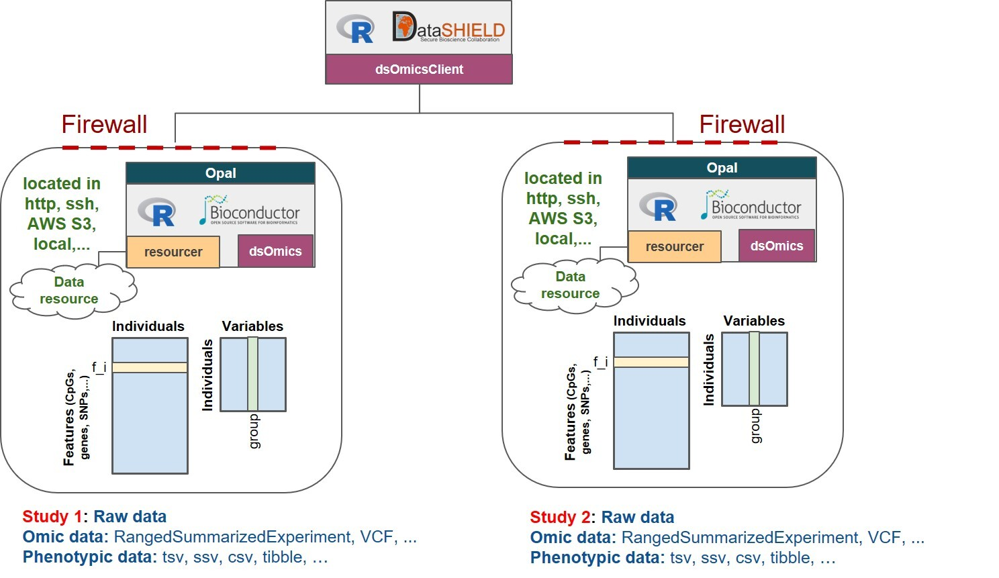
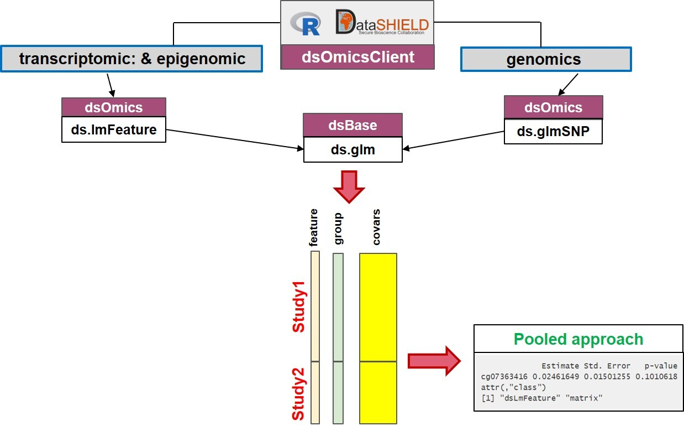
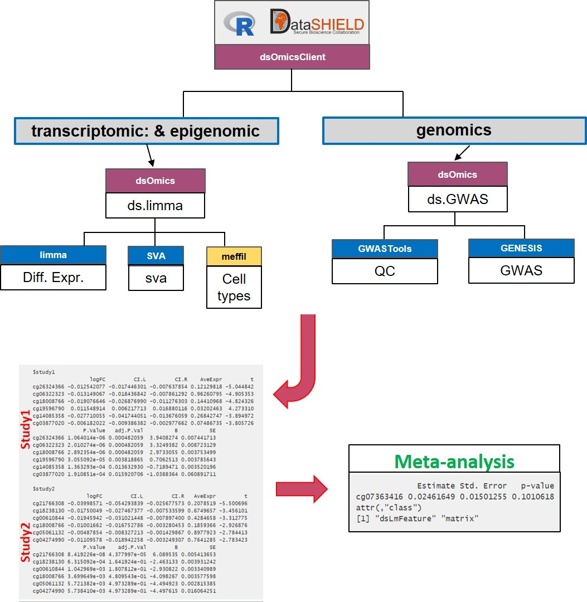

# Analysis using the `resources`


Now, let us illustrate a similar analysis of the previous example using CNSIM datasets but having the data as a resource. Now the resources are available in a project called `RSRC` (see https://opal-demo.obiba.org/#/project/RSRC/resources). Now, we write all the require code in a single chunk:

```{r cnsim_multiple}
library(DSOpal)
library(dsBaseClient)

# prepare login data and resources to assign
builder <- DSI::newDSLoginBuilder()
builder$append(server = "study1", url = "https://opal-demo.obiba.org", 
               user = "dsuser", password = "P@ssw0rd", 
               resource = "RSRC.CNSIM1", profile = "default")
#builder$append(server = "study2", url = "https://opal.isglobal.org/repo",
#               user = "invited",  password = "12345678Aa@",, 
#               resource = "CNSIM.CNSIM2", profile = "rock-inma")

logindata <- builder$build()

# login and assign resources
conns <- datashield.login(logins = logindata, assign = TRUE, symbol = "res")

# assigned objects are of class ResourceClient (and others)
ds.class("res")

# coerce ResourceClient objects to data.frames
# (DataSHIELD config allows as.resource.data.frame() assignment function for the purpose of the demo)
datashield.assign.expr(conns, symbol = "D", 
                       expr = quote(as.resource.data.frame(res, strict = TRUE)))
ds.class("D")
ds.colnames("D")

# do usual dsBase analysis
ds.summary('D$LAB_HDL')

# vector types are not necessarily the same depending on the data reader that was used
ds.class('D$GENDER')
ds.asFactor('D$GENDER', 'GENDER')
ds.summary('GENDER')

mod <- ds.glm("DIS_DIAB ~ LAB_TRIG + GENDER", data = "D" , family="binomial")
mod$coeff


datashield.logout(conns)
```


The Figure \@ref(fig:opalOmic) describes the different types of 'omic association analyses that can be performed using DataSHIELD client functions implemented in the `r BiocStyle::Githubpkg("isglobal-brge/dsOmicsClient")` package. Basically, data ('omic and phenotypes/covariates) can be stored in different sites (http, ssh, AWS S3, local, ...) and are managed with Opal through the `r BiocStyle::Githubpkg("obiba/resourcer")` package and their extensions implemented in `r BiocStyle::Githubpkg("isglobal-brge/dsOmics")`.  


```{r opalOmic, echo=FALSE, fig.cap="Non-disclosive omic data analysis with DataSHIELD and Bioconductor. The figure illustrates how the `resourcer` package is used to get access to omic data through the Opal servers. Then DataSHIELD is used in the client side to perform non-disclosive data analyses.", fig.align='center'}

```


The `dsOmicsClient` package allows different types of analyses: pooled and meta-analysis. Both methods are based on fitting different Generalized Linear Models (GLMs) for each feature when assessing association between 'omic data and the phenotype/trait/condition of interest. Of course, non-disclosive 'omic data analysis from a single study can also be performed.

The **pooled approach** (Figure \@ref(fig:omicAnal1)) is recommended when the user wants to analyze 'omic data from different sources and obtain results as if the data were located in a single computer. It should be noted that this can be very time consuming when analyzing multiple features since it calls a base function in DataSHIELD (`ds.glm`) repeatedly. It also cannot be recommended when data are not properly harmonized (e.g. gene expression normalized using different methods, GWAS data having different platforms, ...). Furthermore when it is necesary to remove unwanted variability (for transcriptomic and epigenomica analysis) or control for population stratification (for GWAS analysis), this approach cannot be used since we need to develop methods to compute surrogate variables (to remove unwanted variability) or PCAs (to to address population stratification) in a non-disclosive way. 


The **meta-analysis approach** Figure \@ref(fig:omicAnal2) overcomes the limitations raised when performing pooled analyses. First, the computation issue is addressed by using scalable and fast methods to perform data analysis at whole-genome level at each location The transcriptomic and epigenomic data analyses make use of the widely used `r BiocStyle::Biocpkg("limma")` package that uses `ExpressionSet` or `RangedSummarizedExperiment` Bioc infrastructures to deal with 'omic and phenotypic (e.g covariates). The genomic data are analyzed using `r BiocStyle::Biocpkg("GWASTools")` and `r BiocStyle::Biocpkg("GENESIS")` that are designed to perform quality control (QC) and GWAS using GDS infrastructure.


Next, we describe how both approaches are implemented: 

- **Pooled approach:** Figure \@ref(fig:omicAnal1) illustrate how this analysis is performed. This corresponds to generalized linear models (glm) on data from single or multiple sources. It makes use of `ds.glm()` function which is a DataSHIELD function that uses an approach that is mathematically equivalent to placing all individual-level data froma all sources in one central warehouse and analysing those data using the conventional `glm()` function in R. The user can select one (or multiple) features (i.e., genes, transcripts, CpGs, SNPs, ...) 


```{r omicAnal1, echo=FALSE, fig.cap="Non-disclosive omic data analysis with DataSHIELD and Bioconductor. The figure illustrates how to perform single pooled omic data analysis. The analyses are performed by using a generalized linear model (glm) on data from one or multiple sources. It makes use of `ds.glm()`, a DataSHIELD function, that uses an approach that is mathematically equivalent to placing all individual-level data from all sources in one central warehouse and analysing those data using the conventional `glm()` function in R.", fig.align='center'}

```


- **Meta-analysis:** Figure \@ref(fig:omicAnal2) illustrate how this analysis is performed. This corresponds to performing a genome-wide analysis at each location using functions that are specifically design for that purpose and that are scalable. Then the results from each location can be meta-analyzed using methods that meta-analyze either effect sizes or p-values.


```{r omicAnal2, echo=FALSE, fig.cap="Non-disclosive omic data analysis with DataSHIELD and Bioconductor. The figure illustrates how to perform anlyses at genome-wide level from one or multiple sources. It runs standard Bioconductor functions at each server independently to speed up the analyses and in the case of having multiple sources, results can be meta-analyzed uning standar R functions.", fig.align='center'}

```


# Differential gene expression (DGE) analysis


```{r include = FALSE}
# Ensure child Rmd is present (download once if missing)
child_dir <- "rmd_omic"
child_file <- file.path(child_dir, "single_study_analysis_example.Rmd")
if (!dir.exists(child_dir)) dir.create(child_dir, recursive = TRUE, showWarnings = FALSE)
if (!file.exists(child_file)) {
  try(utils::download.file(
    "https://github.com/isglobal-brge/dsOmicsClient/raw/master/vignettes/rmd/single_study_analysis_example.Rmd",
    destfile = child_file,
    quiet = TRUE, mode = "wb"
  ), silent = TRUE)
}
```

```{r child='rmd_omic/single_study_analysis_example.Rmd', include=TRUE, eval=file.exists('rmd_omic/single_study_analysis_example.Rmd')}
```


Don't forget to log out! Using:
```{r}
datashield.logout(conns)
```


# Exercise: CORDELIA Project Analysis

We have a database from the CORDELIA Project (https://cordeliaproject.net/), which collects clinical, demographic, and laboratory information about participants in order to study cardiovascular and metabolic risk factors. The dataset contains the following variables:

- **cohorte** – Cohort (study group the subject belongs to)
- **codigo** – Code / ID (unique identifier for each subject)
- **fec_inc** – Date of inclusion (enrollment date in the study)
- **edad** – Age
- **sexo** – Sex (male/female)
- **est_civ** – Marital status
- **niv_cult** – Educational level
- **act_fis** – Physical activity
- **fumador** – Smoker (yes/no)
- **HTA** – Hypertension (diagnosis)
- **HTA_TTO** – Hypertension treatment (yes/no)
- **hipercol** – Hypercholesterolemia (diagnosis)
- **col_tto** – Cholesterol treatment (yes/no)
- **diabetes** – Diabetes (diagnosis)
- **diab_tto** – Diabetes treatment (yes/no)
- **insulin** – Insulin treatment (yes/no)
- **diab_ado_ins** – Diabetes treated with oral antidiabetics and insulin
- **peso** – Weight (kg)
- **talla** – Height (cm or m)
- **cintura** – Waist circumference (cm)
- **IMC** – Body Mass Index (BMI)
- **FC** – Heart rate (beats per minute)
- **PAS_1** – Systolic blood pressure (1st measurement)
- **PAS_2** – Systolic blood pressure (2nd measurement)
- **PAD_1** – Diastolic blood pressure (1st measurement)
- **PAD_2** – Diastolic blood pressure (2nd measurement)
- **col_tot** – Total cholesterol
- **hdl** – HDL cholesterol
- **ldl** – LDL cholesterol
- **trig** – Triglycerides
- **creat** – Creatinine
- **filt_glomer** – Glomerular filtration rate (GFR)
- **glu** – Blood glucose
- **exitusSeg** – Death during follow-up (yes/no)
- **FechaExit_Seg** – Date of death during follow-up
- **filt_glomer_CKD** – Glomerular filtration rate classified for chronic kidney disease (CKD stages)
- **HTA_tot** – Hypertension (overall variable, combining diagnosis/treatment)
- **diabetes_tot** – Diabetes (overall variable, combining diagnosis/treatment)
- **todeath** – Time to death (follow-up time until death)
- **death** – Death (event indicator, yes/no)

The data is stored on an Opal server within a project named `CORDELIA`, under the resource `cordelia45`, with access credentials provided as follows:

- Server: "https://opal-demo.obiba.org"
- User: "dsuser"
- Password: "P@ssw0rd"

## Tasks

Complete the following tasks:

1. Load the data into a DataSHIELD session
2. Summarize the variable `IMC`
3. Create a histogram of the variable `trig`
4. Assess whether `diabetes` is associated with `hipercol`, `IMC`, `hdl` and `col_tot` in separate univariate models
5. Estimate a multivariate model for the variable `diabetes`, including only those variables that were significant in the univariate models
